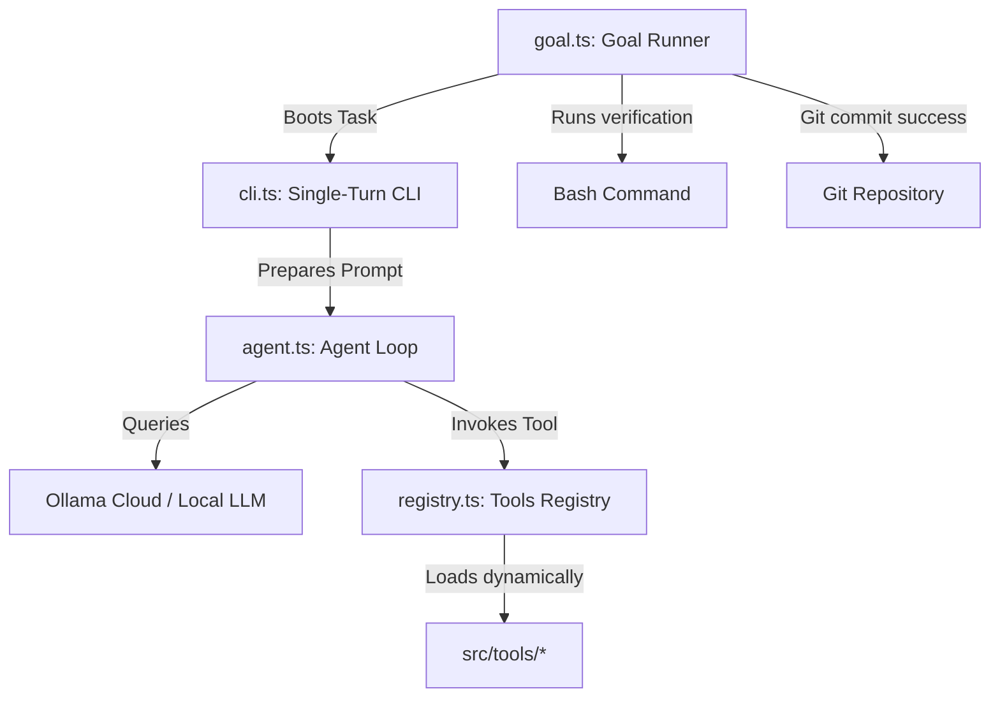

# Quiver: AI Agent Harness for the Terminal

Quiver is a self-evolving agent harness for autonomous coding and research in the terminal. It provides file operations, browser automation, shell command execution, web search, GitHub integration, and persistent memory — designed to work with any OpenAI-compatible LLM. Think of Quiver as a powerful digital companion that works through task checklists, keeps track of project details, and always asks for your permission before taking sensitive actions on your computer.

---

## 💡 How Quiver Works (In Plain English)

Quiver is built to be simple, transparent, and safe:

1. **You set a goal:** You ask Quiver to do a job (like research a company or draft a document) or pick a pre-made checklist.
2. **Quiver breaks it down:** Quiver outlines a step-by-step checklist of tasks.
3. **Quiver executes with your permission:** Quiver works on each task one-by-one. If it needs to perform a sensitive action (like running a command, creating a file, or opening a browser page), it pauses and asks you for permission first.
4. **Quiver checks its own work:** When it completes a task, it compiles and runs verification checks to ensure everything works perfectly before proceeding.

---

## 📂 Understanding the Folders

Here is where different parts of Quiver live, explained simply:

* **🎯 goals.json / active checklist:** The active list of tasks Quiver is currently working on.
* **📂 recipes/**: Pre-packaged task checklists. For example, a "competitor research" blueprint.
* **📂 memory/**: What Quiver remembers about you, your identity preferences, and your project context.
* **📂 skills/**: Simple "how-to" instruction guides you give Quiver to teach it rules or procedures.
* **📂 src/tools/**: The list of actions (capabilities) Quiver can perform—such as searching the web, scraping websites, reading files, or controlling a browser.

---

## 🚀 Getting Started & Installation

You can run Quiver directly from the source code, or install it as a global terminal command.

### Option A: Install Globally (Recommended)
If you want to run Quiver from anywhere on your system:
```bash
npm install -g .
```
Now you can simply run:
```bash
quiver
```

### Option B: Run from Source
1. **Configure your keys:**
   Copy the example configuration file:
   ```bash
   cp .env.example .env
   ```
   Open the `.env` file and insert your API keys.

2. **Start Quiver:**
   Run the interactive CLI session in your terminal:
   ```bash
   npm start
   ```

3. **Run a checklist (recipe):**
   To execute a pre-made checklist from start to finish:
   ```bash
   npx tsx src/goal.ts --recipe market-research
   ```

---

## 📦 Packaging & Public Distribution

If you want to publish Quiver to the public registry so other users can run `npm install -g quiver-agent` or `brew install quiver`, please check out our detailed guide:
*   [PACKAGING.md](PACKAGING.md)

## 🔒 Security & Safety Controls

Your safety is Quiver's top priority. By default, Quiver is configured to request manual approval before running any tool that could modify your system. 
You can customize these checks in your `.env` file using the `REQUIRE_APPROVAL_FOR` variable.

---

## ⌨️ In-Session Commands

| Command | Aliases | Description |
|---------|---------|-------------|
| `/help` | `/h`, `/?` | Show available commands |
| `/tools` | `/t` | List all available AI tools |
| `/session` | `/s` | Show session details and token stats |
| `/config` | `/c` | Show current configuration |
| `/compact` | `/co` | Compact conversation history to save context |
| `/reset` | `/r` | Reset conversation (keeps memory & skills) |
| `/cost` | | Show token usage statistics |
| `/model` | `/m` | Show or change the active model |
| `/history` | `/hi` | Show conversation message summary |
| `/approvals` | `/a` | Manage approval gates (add/remove/clear) |
| `/export` | | Export session to .qf file |
| `/resume` | `/rs` | Resume a previous session (picker) |
| `/clear` | | Clear terminal screen |
| `/exit` | `/quit`, `/q` | End session (auto-saves for resume) |
| `/version` | `/v` | Show Quiver version |

---

## 🔄 Session Persistence & Resume

Quiver automatically saves your conversation state to disk after every turn, so you never lose work to a crash, terminal close, or accidental exit. Modeled after Codex CLI's `codex resume` and Claude Code's `claude --continue`.

### CLI Flags

| Flag | Alias | Description |
|------|-------|-------------|
| `--continue` | `-c` | Resume the most recent session |
| `--resume` | `-r` | Show interactive session picker |
| `--list-sessions` | `-ls` | List all saved sessions |

### Usage

```bash
quiver --continue       # Resume your last session
quiver --resume         # Pick a session to resume
quiver --list-sessions  # List all saved sessions
```

After exit, Quiver prints: `Session saved. Resume with: quiver --continue`

---

## 🛠️ Available Tools

### 📁 Files
- **view_file** — Read files with line numbers and range selection
- **write_file** — Create or overwrite files
- **replace_content** — Surgical find-and-replace in files
- **list_dir** — List directory contents with file sizes
- **format_code** — Format TypeScript/JavaScript files
- **grep_search** — Search file contents with ripgrep/grep

### ⚙️ System
- **run_command** — Execute shell commands
- **run_tests** — Run TypeScript compilation and unit tests
- **create_tool** — Dynamically create new tools at runtime
- **log_tokens** — Parse session logs for token statistics

### 🌐 Web
- **web_search** — Search the web via Ollama Pro or Parallel.ai
- **scrape_url** — Scrape web pages to markdown
- **search_docs** — Query Context7 for library documentation
- **browser_control** — Control a headless browser session
- **deep_research** — Multi-hop web research with citations (Parallel Task API)
- **find_all** — Discover and verify entities matching criteria (Parallel FindAll API)
- **entity_search** — Fast synchronous people/company search (Parallel Entity Search)

### 🧠 Memory
- **memory_append** — Append facts to persistent memory
- **memory_replace** — Replace persistent memory file contents

### 🐙 GitHub
- **github** — GitHub API operations (issues, PRs, contents)

---

## ⚙️ Developer & AI Agent Reference

*(If you are a developer looking to write code for Quiver, or an LLM Agent reading this repository, this section is for you.)*

### Project Directory Structure
```
quiver/
├── 🎯 goals.json             # Active session task checklist (stateful)
├── ⚙️  .env.example           # Reference environment configurations
├── 📂 memory/                # Agent core memory blocks (identity, project context)
├── 📂 recipes/               # Reusable session blueprints (stateless templates)
├── 📂 skills/                # Task instruction guides (procedural knowledge)
├── 📂 src/
│   ├── 🤖 agent.ts           # Core execution loop & prompt compilation
│   ├── 🖥️  cli.ts             # Interactive single-turn/multi-turn shell
│   ├── ⚙️  config.ts          # Config parsing & validation
│   ├── 📊 dashboard.ts        # OpenTUI full-screen terminal interface
│   ├── 🎯 goal.ts             # Outer goal runner loop (git-committed states)
│   ├── 📂 tools/             # Dynamically loaded atomic tools registry
│   └── 🔌 registry.ts         # Runtime tool loader & cache-busting loader
└── 🧪 tests/                 # Registry & cache-busting tests
```

### Architecture & Execution Model


1. **Goal Runner (`src/goal.ts`)**: Manages the stateful `goals.json` checklist. Spawns the CLI for the next pending goal, runs verification tests, and commits progress to Git.
2. **Self-Evolving Agent (`src/agent.ts`)**: Prepares system instructions by blending memory with active skills. Handles the completions stream, prompts for human approvals, and executes tools. Includes context window management with auto-trimming and manual compaction.
3. **Dynamic Registry (`src/registry.ts`)**: Scans `src/tools/` dynamically, enabling the agent to write and execute its own tools immediately in the same session.

### 🤖 Agent Guidance (LLM System Context)
*   **Extending Capabilities:** Write a new TypeScript tool using the `create_tool` tool. Every tool file must export a `tool` object of type `Tool` defined in [src/registry.ts](src/registry.ts).
*   **Reading & Writing Memory:** Load core memories using `loadCoreMemory()` from [src/state.ts](src/state.ts). Update them using `memory_append` and `memory_replace` tools.
*   **Subprocesses & Approvals:** Check [src/config.ts](src/config.ts) (`config.requireApprovalFor`) to see which tools require approval.
*   **Context Management:** Use `/compact` to manually trim conversation history, or configure `QUIVER_MAX_CONTEXT_TOKENS` for automatic trimming.