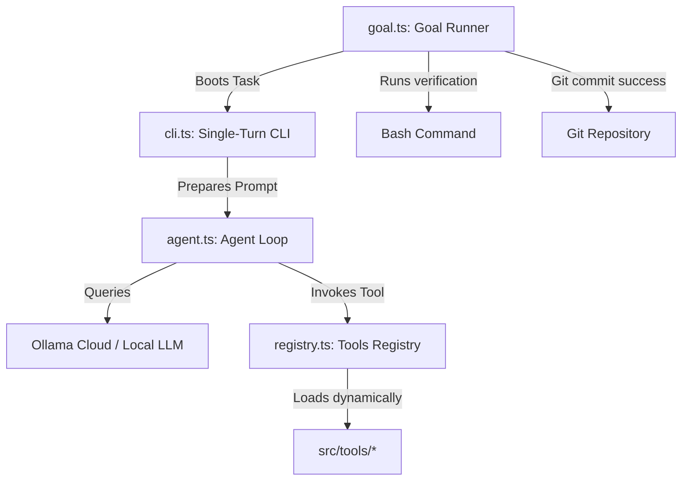

# Quiver: Your Personal AI Helper

Quiver is a friendly, personal AI assistant designed to help you automate web research, browse websites, write content, and check code. Think of Quiver as a helpful digital companion that works through task checklists, keeps track of project details, and always asks for your permission before taking sensitive actions on your computer.

---

## 💡 How Quiver Works (In Plain English)

Quiver is built to be simple, transparent, and safe:

1. **You set a goal:** You ask Quiver to do a job (like research a company or draft a document) or pick a pre-made checklist.
2. **Quiver breaks it down:** Quiver outlines a step-by-step checklist of tasks.
3. **Quiver executes with your permission:** Quiver works on each task one-by-one. If it needs to perform a sensitive action (like running a command, creating a file, or opening a browser page), it pauses and asks you for permission first.
4. **Quiver checks its own work:** When it completes a task, it compiles and runs verification checks to ensure everything works perfectly before proceeding.

---

## 📂 Understanding the Folders

Here is where different parts of Quiver live, explained simply:

* **🎯 goals.json / active checklist:** The active list of tasks Quiver is currently working on.
* **📂 recipes/**: Pre-packaged task checklists. For example, a "competitor research" blueprint.
* **📂 memory/**: What Quiver remembers about you, your identity preferences, and your project context.
* **📂 skills/**: Simple "how-to" instruction guides you give Quiver to teach it rules or procedures.
* **📂 src/tools/**: The list of actions (capabilities) Quiver can perform—such as searching the web, scraping websites, reading files, or controlling a browser.

---

## 🚀 Getting Started

To run Quiver and start talking to your assistant:

1. **Configure your keys:**
   Copy the example configuration file:
   ```bash
   cp .env.example .env
   ```
   Open the `.env` file and insert your API keys.

2. **Start Quiver:**
   Run the interactive CLI session in your terminal:
   ```bash
   npm start
   ```

3. **Run a checklist (recipe):**
   To execute a pre-made checklist from start to finish:
   ```bash
   npx tsx src/goal.ts --recipe market-research
   ```

---

## 🔒 Security & Safety Controls

Your safety is Quiver's top priority. By default, Quiver is configured to request manual approval before running any tool that could modify your system. 
You can customize these checks in your `.env` file using the `REQUIRE_APPROVAL_FOR` variable.

---

## ⚙️ Developer & AI Agent Reference

*(If you are a developer looking to write code for Quiver, or an LLM Agent reading this repository, this section is for you.)*

### Project Directory Structure
```
quiver/
├── 🎯 goals.json             # Active session task checklist (stateful)
├── ⚙️  .env.example           # Reference environment configurations
├── 📂 memory/                # Agent core memory blocks (identity, project context)
├── 📂 recipes/               # Reusable session blueprints (stateless templates)
├── 📂 skills/                # Task instruction guides (procedural knowledge)
├── 📂 src/
│   ├── 🤖 agent.ts           # Core execution loop & prompt compilation
│   ├── 🖥️  cli.ts             # Interactive single-turn/multi-turn shell
│   ├── ⚙️  config.ts          # Config parsing & validation
│   ├── 📊 dashboard.ts        # OpenTUI full-screen terminal interface
│   ├── 🎯 goal.ts             # Outer goal runner loop (git-committed states)
│   ├── 📂 tools/             # Dynamically loaded atomic tools registry
│   └── 🔌 registry.ts         # Runtime tool loader & cache-busting loader
└── 🧪 tests/                 # Registry & cache-busting tests
```

### Architecture & Execution Model


1. **Goal Runner (`src/goal.ts`)**: Manages the stateful `goals.json` checklist. Spawns the CLI for the next pending goal, runs verification tests, and commits progress to Git.
2. **Self-Evolving Agent (`src/agent.ts`)**: Prepares system instructions by blending memory with active skills. Handles the completions stream, prompts for human approvals, and executes tools.
3. **Dynamic Registry (`src/registry.ts`)**: Scans `src/tools/` dynamically, enabling the agent to write and execute its own tools immediately in the same session.

### 🤖 Agent Guidance (LLM System Context)
*   **Extending Capabilities:** Write a new TypeScript tool using the `create_tool` tool. Every tool file must export a `tool` object of type `Tool` defined in [src/registry.ts](file:///Users/rahul/quiver/src/registry.ts).
*   **Reading & Writing Memory:** Load core memories using `loadCoreMemory()` from [src/state.ts](file:///Users/rahul/quiver/src/state.ts). Update them using `memory_append` and `memory_replace` tools.
*   **Subprocesses & Approvals:** Check [src/config.ts](file:///Users/rahul/quiver/src/config.ts) (`config.requireApprovalFor`) to see which tools require approval.
