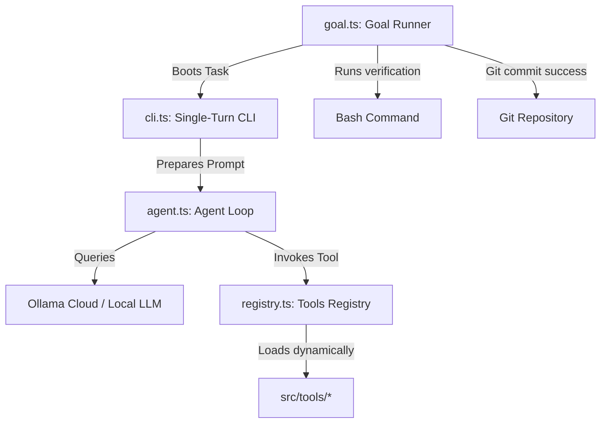

# Quiver: Stateful Self-Evolving Agent Harness

Quiver is an open-source, model-agnostic agent harness designed for autonomous coding, research, and general goal-seeking. It wraps standard LLMs (local or cloud-hosted) inside an execution loop equipped with persistent memory, dynamic skill directories, human-in-the-loop security gates, and a terminal TUI dashboard.

---

## 📂 Project Directory Structure

```
quiver/
├── 🎯 goals.json             # Active session task checklist (stateful)
├── ⚙️  .env.example           # Reference environment configurations
├── 📂 memory/                # Agent core memory blocks (identity, project context)
├── 📂 recipes/               # Reusable session blueprints (stateless templates)
├── 📂 skills/                # Task instruction guides (procedural knowledge)
├── 📂 src/
│   ├── 🤖 agent.ts           # Core execution loop & prompt compilation
│   ├── 🖥️  cli.ts             # Interactive single-turn/multi-turn shell
│   ├── ⚙️  config.ts          # Config parsing & validation
│   ├── 📊 dashboard.ts        # OpenTUI full-screen terminal interface
│   ├── 🎯 goal.ts             # Outer goal runner loop (git-committed states)
│   ├── 📂 tools/             # Dynamically loaded atomic tools registry
│   └── 🔌 registry.ts         # Runtime tool loader & cache-busting loader
└── 🧪 tests/                 # Registry & cache-busting tests
```

---

## 🎯 Architecture & Execution Model

Quiver decouples the agent's brain from the harness interface, split across three layers:



1.  **Stateful Goal Runner (`src/goal.ts`)**: Processes the active `goals.json` checklist. It spawns the single-turn CLI for the next pending goal, runs verification tests upon return, and commits changes to Git, looping until all goals are achieved.
2.  **Self-Evolving Agent (`src/agent.ts`)**: Prepares system prompts by blending core memory with active skills. It handles the LLM completions stream, detects tool calls, queries human approvals, executes tools, and feeds results back recursively.
3.  **Dynamic Registry (`src/registry.ts`)**: Scans `src/tools/` at runtime, importing tools dynamically with timestamped query parameters to bust Node's ESM module cache. This enables the agent to write and execute its own tools immediately in the same session.

---

## 💡 Conceptual Hierarchy: Recipes vs. Skills

To keep the harness pristine, follow this distinction when modifying the agent's behavior:

*   **Skills (`skills/<name>/SKILL.md`) — *Instructions (How to do it)***:
    *   *Stateless guides* injected into the system prompt context.
    *   Teaches the model rules, best practices, coding style, or APIs (e.g. *"How to write a unit test in tsx"*, *"How to format a git commit"*).
*   **Recipes (`recipes/<name>.json`) — *Blueprints (What to do)***:
    *   *Stateless templates* loaded once at session startup using `--recipe <name>`.
    *   Bootstraps a clean workspace and populates `goals.json` with initial goals and configurations.
*   **Active Tasks (`goals.json`) — *State (Current progress)***:
    *   *Stateful list* containing IDs, status, and shell-based verification assertions.

---

## 🤖 Agent Guidance (LLM System Context)

> [!NOTE]
> **Read This Section Carefully If You Are an LLM Agent Working in Quiver.**
> 
> You have the power to extend your own capabilities, mutate code, and manage goals. Use the following instructions to navigate and evolve the repository:

### 1. Extending Capabilities (Self-Evolution)
*   If you need a tool that is not in `src/tools/`, write a new TypeScript tool using the `create_tool` tool.
*   **Tool Specification:** Every tool file must export a `tool` object of type `Tool` defined in [src/registry.ts](file:///Users/rahul/quiver/src/registry.ts):
    ```typescript
    import { z } from "zod";
    import { Tool } from "../registry.js";

    export const tool: Tool = {
      name: "my_new_tool",
      description: "Description of what this tool does.",
      parameters: z.object({
        arg1: z.string().describe("Argument description"),
      }),
      execute: async ({ arg1 }) => {
        // Implementation
        return "Success message";
      }
    };
    ```
*   Once written, the `ToolRegistry` dynamically imports the tool on the next turn, bypassing ESM cache constraints.

### 2. Reading & Writing Memory
*   Core memories reside in `memory/core.json`. Load them using `loadCoreMemory()` from [src/state.ts](file:///Users/rahul/quiver/src/state.ts).
*   Update core memory using the `memory_append` and `memory_replace` tools. Do not write directly to `memory/core.json` unless executing setup tasks.

### 3. Executing Subprocesses & Approvals
*   Sensitive actions (e.g., executing commands, writing files, and controlling the browser) are bound to the human-in-the-loop approval gate.
*   Check [src/config.ts](file:///Users/rahul/quiver/src/config.ts) (`config.requireApprovalFor`) to see which tools require approval. Design your outputs to minimize redundant tool invocations when waiting for human input.
