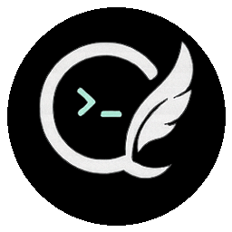

<p align="center">
  
</p>

<h1 align="center">Quiver</h1>

<p align="center">Your AI analyst, researcher, and writer.</p>

---

A local-first AI work assistant for business users — analysts, researchers, consultants, legal professionals, and operators. Research companies, analyze markets, produce investment briefs and compliance reviews — with cited sources, verification gates, and professional Office documents. Your data stays on your machine.

**For non-technical users:** Download the desktop app — no terminal needed.  
**For developers:** Install the CLI or use the desktop app. Both share the same memory and sessions.

## Quick Start

### Desktop App (recommended for business users)

```bash
npm run gui
```

No terminal knowledge needed — just chat with the AI, review its work, and preview the documents it creates.

### CLI (for developers and power users)

```bash
npm install -g .
quiver init        # Set up .env with your API key
quiver             # Start a session
```

## Vision Fallback

The primary model is optimised for coding but text-only. When you attach an image or video, Quiver automatically routes the request to the best multimodal model via Ollama:

```bash
ollama pull <multimodal-model>   # Install your preferred vision model
```

Configure via `VISION_MODEL_NAME` in `.env` or Settings → Vision Model in the GUI.

## Architecture

```
~/.quiver/                          # Global (shared across projects)
├── core.json                        # Identity + user context
├── skills/                          # Skills (reusable procedures)
│   ├── system-prompt/SKILL.md      # The system prompt (editable)
│   └── cli-for-agents/SKILL.md     # CLI design patterns
└── projects/{name}/
    ├── memory/                      # Per-project memory
    │   ├── persona.txt              # Agent behavior notes
    │   ├── human.txt                # User details
    │   ├── project.json             # Project context
    │   ├── user-preferences.md      # Auto-learned preferences
    │   └── workspace-facts.md       # Auto-learned facts
    └── .sessions/                   # Session logs + state
```

Cloud sync: auto-detects Google Drive, OneDrive, Dropbox, iCloud. Syncs to `{cloud}/Quiver/` after every turn. No OAuth — just files in a folder.

## Tools

| Category | Tools |
|----------|-------|
| Local storage | view_file, write_file, replace_content, apply_patch, list_dir, glob, format_code, grep_search |
| System | run_command, run_tests, create_tool, log_tokens |
| Web | web_search, scrape_url, browser_control, deep_research, find_all, entity_search |
| Memory | memory_append, memory_replace, continual_learning |
| GitHub | github |
| Planning | todo_write, ask_question |
| Self-improvement | prompt_update |
| Iteration | ralph_loop |
| Agents | subagent |
| Office | office_doc (Word .docx, Excel .xlsx, PowerPoint .pptx via OfficeCLI) |
| MCP | External tools via Model Context Protocol (`.quiver/mcp.json`) |

## MCP Support

Quiver supports MCP servers as external tool providers. Configure servers in `.quiver/mcp.json`:

```json
{
  "mcpServers": {
    "filesystem": {
      "command": "npx",
      "args": ["-y", "@modelcontextprotocol/server-filesystem", "/tmp"]
    }
  }
}
```

MCP tools appear as `mcp_<server>_<tool>` and are transparent in the audit trail. Use `/mcp` to see connected servers. See `.quiver/mcp.example.json` for a sample config.

## Principles

1. **Your data stays local** — Research, memory, and conversation history live in files on your machine. Nothing sent to third-party servers unless you use a web research tool.
2. **Context Transparency** — See what memory, skills, and context enter each AI call. Edit them before the AI starts working.
3. **Every claim has a source** — The AI cites its sources inline. No hallucinated data, no invented references.
4. **Verification before delivery** — High-risk outputs are validated by a maker-checker system before they reach you.
5. **Audit trail** — Every action logged in a tamper-evident hash-chained audit log. Compliance-ready by design.
6. **Professional documents** — Word, Excel, PowerPoint created natively. No Microsoft Office needed.
7. **Model independence** — Swap AI providers without losing your work history.
8. **Extensible** — Connect external tools via MCP. The AI can even build new tools at runtime.

## Commands

| Command | Description |
|---------|-------------|
| `/help` | Show available commands |
| `/tools` | List all tools |
| `/config` | Show configuration |
| `/model <name>` | Change model |
| `/compact` | Compact conversation history |
| `/reset` | Reset conversation (keeps memory) |
| `/resume` | Resume a previous session |
| `/exit` | End session (auto-saves) |
| `/mcp` | Show MCP server connections |
| `/yolo` | Top trust tier — bypass ALL approval gates + path sandbox off |
| `/autonomy` | Trust tiers & grants (`tier observe→yolo`, add/remove grants, sandbox) |
| `/sandbox` | Toggle path sandbox on/off (YOLO tier required to disable) |

## Permissions & Trust Tiers

Quiver's permissioning is an **incremental ladder** from most-restrictive to
fully-unrestricted, plus mid-run intervention so you can steer the agent while
it works.

### Trust tiers (`/autonomy tier <name>`)

| Tier | Grants | Read scope | Sandbox |
|------|--------|-----------|---------|
| `observe` | none — every state change prompts | workspace only | on |
| `propose` | + workspace writes, todo/memory | workspace | on |
| `build` | + safe/moderate shell, web tools | workspace + home | on |
| `operate` | + destructive, privileged, network, browser | filesystem | on |
| `yolo` | everything | filesystem | **off** — agent can act anywhere on the machine |

Tiers are **cumulative** (each builds on the one below) and **per-project**
(persisted to `~/.quiver/projects/<id>/permissions.json`). Raw grants can still
be mixed and matched via `/autonomy add|remove|set`. Filesystem writes can be
further scoped with per-policy allow-globs (e.g. "writes only under `src/`").

Approval prompts offer **(y)** once, **(a)** all-similar-this-session, or
**(N)** — the scoped approval cache silences repeated safe actions without a
global grant.

### Ambient self-heal + goal-loop (always on)

Self-healing and goal-seeking are **ambient characteristics of the harness**,
not commands you invoke. There is exactly **one verification primitive** — the
maker-checker (`runChecker`, which runs the acceptance contract incl. the
always-on `tsc` check on an isolated scratchpad) — and all three behaviors are
driven by it, so there is no parallel `tsc`/`npm test` pipeline doing redundant
work:

1. **Maker-checker (per-change, targeted)** — every high-risk change is verified
   by the isolated checker *before* it commits. On revise/reject it rolls the
   change back and hands the verdict+evidence to the model — that *is* per-change
   self-heal. Always on (no opt-out).
2. **Goal-loop** — the agent loop does not stop until the per-change checker has
   approved every change *and* the completion check (below) passes.
3. **Self-heal (completion, full)** — when the agent would stop after a
   file-mutating task, the harness runs the *same* checker once in FULL mode
   (no target filter) to catch integration / non-targeted regressions the
   per-change targeted checks don't cover. If it revises/rejects, the evidence
   is injected and the loop continues until the checker approves. Capped at 5
   heal rounds (`QUIVER_AMBIENT_MAX_ROUNDS`).

Per-change verification is targeted (fast); completion verification is full
(one run). Same primitive, two scopes — no duplication. Read-only turns
(questions, research) skip the gate, so chats stay one-shot. `/override`
remains as the manual escape hatch for a maker-checker verdict.

### Mid-run intervention

While the agent is running, press **Esc** to pause and type a steering
message. It is injected as a user instruction at the next step boundary, so
the model sees it alongside its prior tool results — the same "type while it
works" capability as Codex CLI / Claude Code. **Ctrl+C** still aborts the
active generation immediately (press twice to exit).

## CLI Flags

| Flag | Description |
|------|-------------|
| `--continue`, `-c` | Resume most recent session |
| `--resume`, `-r` | Pick a session to resume |
| `--list-sessions` | List saved sessions |
| `--single-turn "prompt"` | Run one prompt and exit |
| `--json` | Structured JSON output (for scripts) |
| `--dry-run`, `-n` | Preview tool actions without executing |

## Configuration

Quiver reads a small, fixed set of environment variables from `.env` (see
`.env.example`). API keys may also be stored in the OS keychain. A **single
`OLLAMA_API_KEY`** powers the primary LLM, the Ollama adapter, and the vision
adapter — no separate LLM/vision keys are required. `LLM_API_KEY`,
`VISION_MODEL_API_KEY`, and `CONTEXT7_API_KEY` are retired.

| Variable | Required | Description |
| --- | --- | --- |
| `OLLAMA_API_KEY` | yes | Single API key for the LLM, Ollama, and vision adapters |
| `LLM_API_BASE_URL` | no | LLM API base URL (default `https://ollama.com/v1`) |
| `LLM_MODEL_NAME` | no | Primary model — source-controlled default, override only |
| `VISION_MODEL_NAME` | no | Vision model — source-controlled default, override only |
| `VISION_MODEL_BASE_URL` | no | Vision adapter base URL |
| `QUIVER_AUTONOMY` | no | Comma-separated autonomy grants or a tier (e.g. `tier:build`); see `/autonomy` |
| `QUIVER_MAX_CONTEXT_TOKENS` | no | Context window limit (default `120000`) |
| | | (browser visibility is now controlled via `QUIVER_AUTONOMY=browser:visible`) |
| `QUIVER_SESSION_LOG` | no | `0` to disable session logging |
| `QUIVER_SESSION_LOG_MAX_CHARS` | no | Max chars logged per session message |
| `PARALLEL_API_KEY` | optional | Powers web search, scrape, deep research, find_all |
| `GITHUB_TOKEN` | optional | GitHub tooling (issues/PRs/repos) — developers only |

Model names are source-controlled in `src/config.ts`; the first-run wizard
never asks for a model name. Cloud sync, when enabled, additionally reads
opt-in sync flags — see `docs/sync.md`.

## Desktop App

The Quiver desktop app is the recommended interface for business users — no terminal needed:

```bash
npm run gui
```

Features:
- **Chat interface** — just type what you need, like any messaging app
- **Session history** — pick up where you left off
- **Context panel** — see what the AI knows and edit it
- **Document preview** — see Word/Excel/PPT the AI creates, without opening them
- **Approval gates** — review and approve before the AI takes significant actions
- **Drag-and-drop images** — drop charts, screenshots, or documents for the AI to analyze

The desktop app shares the same `~/.quiver/` memory and sessions as the CLI — switch between them freely.

## Self-Improvement

Quiver can propose updates to its own system prompt using `prompt_update`. The user reviews, edits, or rejects proposed changes — the agent never modifies the prompt directly.

`continual_learning` mines past session transcripts for high-signal patterns and writes them to `user-preferences.md` and `workspace-facts.md` in the project memory directory.

## Development & Testing

```bash
npm test            # THE checker-owned acceptance contract (143 checks) — must stay green.
                     # Asserts the SPEC AND that src/agent.ts + the file tools actually wire in
                     # the provider/adapter, assembler, budget, path sandbox, command classifier,
                     # read-before-write, atomic write, checkpoint, diagnostics, memory privacy,
                     # citation/decay, and lifecycle hooks (WIRE-* checks) — not just that they exist.
npx tsc --noEmit    # Definition of Done: clean typecheck
```

The acceptance contract (`tests/spec_acceptance_tests.ts`) is **read-only to the
vendor**. It is the single checker-owned gate: it asserts both the spec behavior and
(via its `WIRE-*` checks) that the modules are actually wired into `src/agent.ts` and
the file tools. Status (2026-06-28 re-audit): 143/143 met, 0 failing — the gate is
GREEN. All maker-checker controls, symlink validation realpath checks, environment sanitizations,
and automated rollback routines are active. `npm test` is the only live verdict — re-run it before
trusting any status text. See `tests/ACCEPTANCE_CONTRACT.md` and `docs/testing.md`.

## Feature Flags (internal)

| Variable | Default | Description |
| --- | --- | --- |
| `QUIVER_MAKER_CHECKER` | — | Maker-checker verification is an ambient, always-on gate (not configurable): every high-risk change is verified by the isolated checker before commit. |
| `QUIVER_AMBIENT` | on | Ambient self-heal + goal-loop (on by default): at task completion the harness runs the maker-checker (full) and auto-continues healing until it approves. Set `=0` to disable. |
| `QUIVER_LOG_RETENTION_DAYS` | 30 | Ambient log retention: old session logs are auto-purged at startup (days; `0` = keep forever). On by default so non-technical users never manage log disk usage. |
| `QUIVER_LIFECYCLE_TRACE` | off | Print a one-line trace of each lifecycle hook firing (`BEFORE_MODEL → …`). Off by default to avoid console noise; audit data is always captured in the session log. |

## License


Apache License